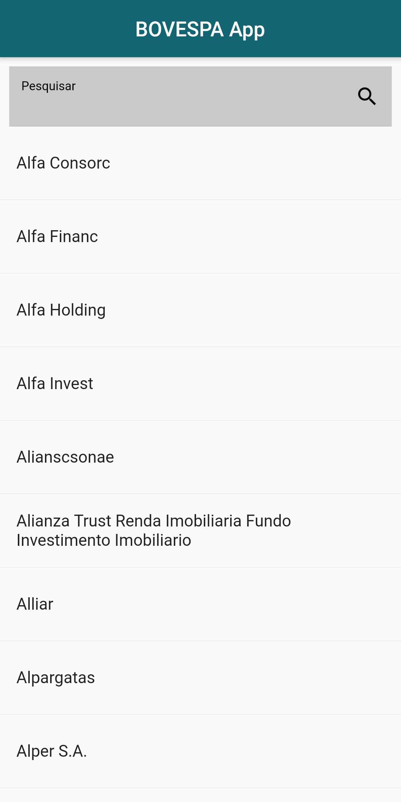
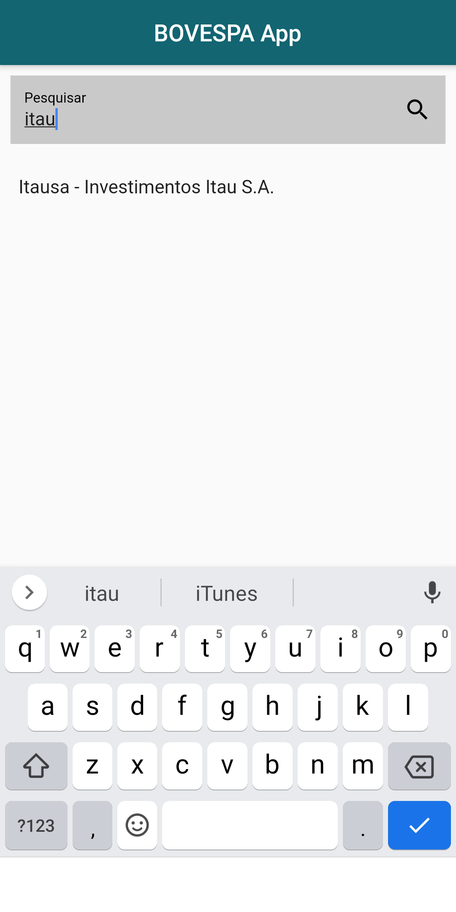
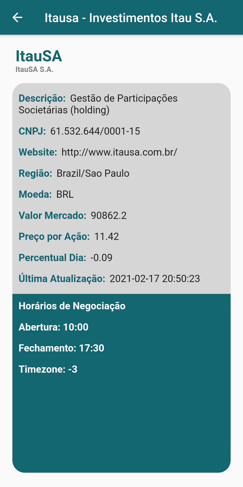

# BOVESPA APP

A flutter project that consults stocks prices on BOVESPA.

## Overview

This project is composed by two screens.

First one, has a list of symbols available at [BOVESPA](https://console.hgbrasil.com/documentation/finance/symbols), that you can consult.
  It's also possible to search for a specific symbol as shown in the image bellow.

And the second screen is composed by all symbol's informations that we receive from the API.

## Extra Informations

- This application was built during the course "Desenvolvimento de Sistemas para Dispositivos Móveis" (Mobile Software Development) offered at Universidade Federal do Rio Grande do Norte (Federal University of Rio Grande do Norte - UFRN) and taught by Itamir Filho.
- It uses [HG Brasil](https://hgbrasil.com/) API, HG Finance.
